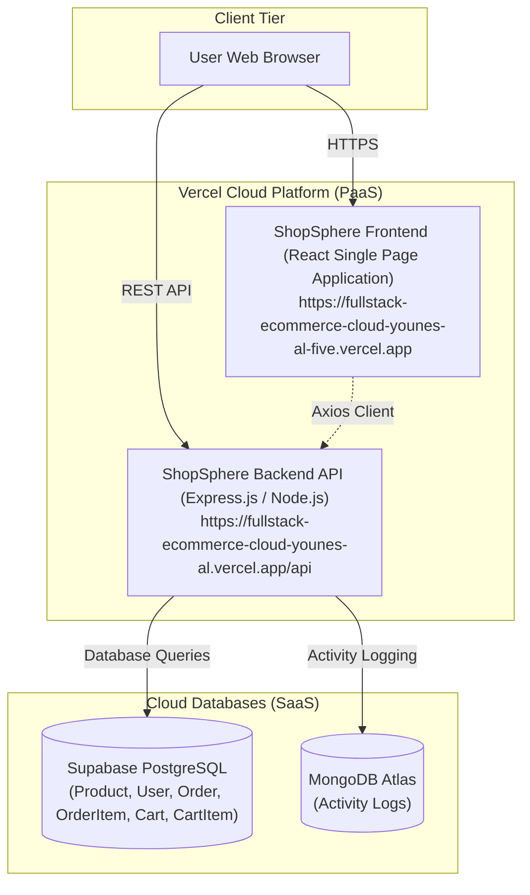

# Task 2 — Sub-task 2.1: Production Architecture Diagram

**Student ID:** `EYOUTH-31007200201119`  
**Student Name:** Younes Aly  
**Project:** ShopSphere Enterprise Production and Cloud Modernization  

---

## Production Architecture Diagram

The diagram below describes the production deployment delivered in **Task 1**, showing the frontend, backend, databases, and the communication paths between them:

### Description of Traffic Routes:
1. **User to Frontend:** The user loads the React Single Page Application over secure HTTPS from Vercel's global CDN.
2. **User / Frontend to Backend:** The frontend sends asynchronous REST API requests (JSON payloads) to the backend API (`/api/products`, `/api/orders`, `/api/login`, etc.).
3. **Backend to Supabase PostgreSQL:** The backend reads and writes relational data (products, user accounts, orders, and shopping cart items) to the Supabase cloud database.
4. **Backend to MongoDB Atlas:** The backend logs administrative events and user audit trails to MongoDB Atlas.
