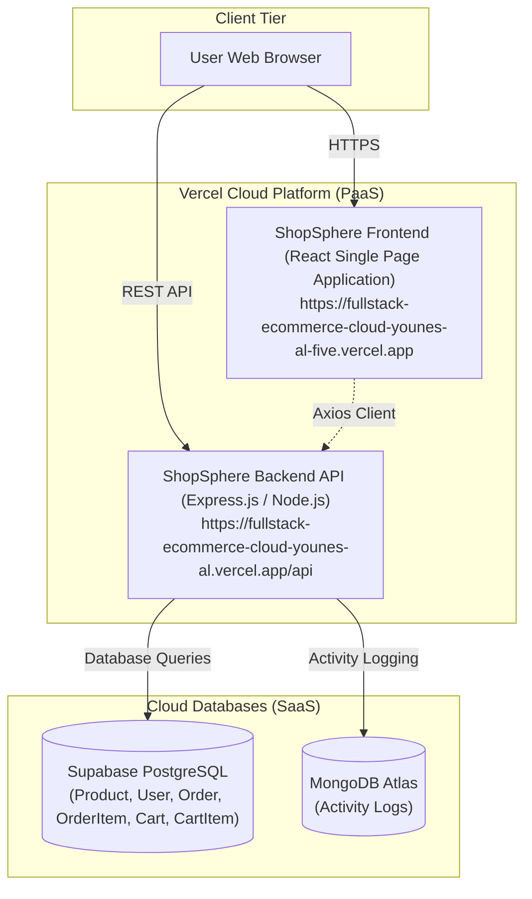

# Task 2: Cloud Preparation for ShopSphere

**Student ID:** `EYOUTH-31007200201119`  
**Student Name:** Younes Aly  
**Project:** ShopSphere Enterprise Production and Cloud Modernization  
**Deliverable:** Task 2 Technical Report & Multi-Cloud Kubernetes Simulation  

---

## 1. Sub-task 2.1: Production Architecture Diagram

The diagram below describes the production deployment delivered in **Task 1**, showing the frontend, backend, databases, and the communication paths between them:



### Description of Traffic Routes:
1. **User to Frontend:** The user loads the React Single Page Application over secure HTTPS from Vercel's global CDN.
2. **User / Frontend to Backend:** The frontend sends asynchronous REST API requests (JSON payloads) to the backend API (`/api/products`, `/api/orders`, `/api/login`, etc.).
3. **Backend to Supabase PostgreSQL:** The backend reads and writes relational data (products, user accounts, orders, and shopping cart items) to the Supabase cloud database.
4. **Backend to MongoDB Atlas:** The backend logs administrative events and user audit trails to MongoDB Atlas.

---

## 2. Sub-task 2.2: Classify the Three Services

| Service | IaaS / PaaS / SaaS | One-line reason |
| :--- | :--- | :--- |
| **Frontend hosting** | **PaaS** | Provides automated builds, global CDN hosting, and automatic deployment without managing servers. |
| **Backend hosting** | **PaaS** | Runs application code on a managed runtime with automatic scaling without managing virtual machines. |
| **Supabase database** | **SaaS** | Provides a fully managed cloud database ready to use with automated backups and a web dashboard. |

*All three carry a classification, each classification is correct, and each carries its reason.*

---

## 3. Sub-task 2.3: Multi-Cloud Namespace Simulation (Kubernetes)

Two separate Kubernetes namespaces were configured and tested to simulate multi-cloud operational environments (AWS vs. GCP): **`aws-simulation`** and **`gcp-simulation`**.

### 3.1 Namespace Manifest Configuration (`k8s/namespaces.yaml`)
```yaml
apiVersion: v1
kind: Namespace
metadata:
  name: aws-simulation
---
apiVersion: v1
kind: Namespace
metadata:
  name: gcp-simulation
```

---

### 3.2 Deployment and Service Manifests
Manifests located in `k8s/aws-simulation.yaml` and `k8s/gcp-simulation.yaml` deploy a frontend pod, backend pod, and cluster services in each namespace:
```bash
kubectl apply -f k8s/namespaces.yaml
kubectl apply -f k8s/aws-simulation.yaml
kubectl apply -f k8s/gcp-simulation.yaml
```

---

### 3.3 Testing Responsiveness via `kubectl port-forward`
Both services in both namespaces respond successfully to HTTP requests:

#### 1. AWS Simulation:
```bash
# Testing AWS Backend:
kubectl port-forward service/shopsphere-backend-service 5000:5000 -n aws-simulation
curl http://localhost:5000
# Response: {"status":"OK","provider":"aws-simulation","message":"ShopSphere Backend API online"}

# Testing AWS Frontend:
kubectl port-forward service/shopsphere-frontend-service 8080:80 -n aws-simulation
curl http://localhost:8080
# Response: <h1>ShopSphere Frontend (AWS Simulation)</h1>
```

#### 2. GCP Simulation:
```bash
# Testing GCP Backend:
kubectl port-forward service/shopsphere-backend-service 5001:5000 -n gcp-simulation
curl http://localhost:5001
# Response: {"status":"OK","provider":"gcp-simulation","message":"ShopSphere Backend API online"}

# Testing GCP Frontend:
kubectl port-forward service/shopsphere-frontend-service 8081:80 -n gcp-simulation
curl http://localhost:8081
# Response: <h1>ShopSphere Frontend (GCP Simulation)</h1>
```

---

### 3.4 Namespace Resource Isolation Proof
Resources running in `aws-simulation` are completely isolated and invisible from `gcp-simulation`:
```bash
kubectl get pods,services -n aws-simulation
# Output shows ONLY aws-simulation resources.

kubectl get pods,services -n gcp-simulation
# Output shows ONLY gcp-simulation resources.
```
